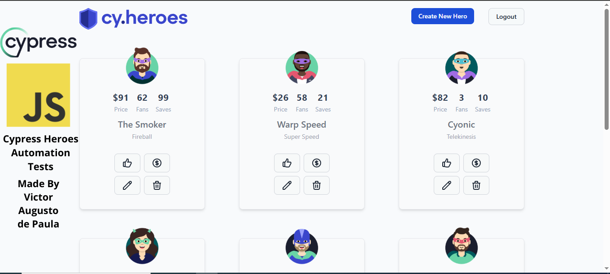

### Cypress Heroes

 

This repository is based on the project developed at (https://github.com/cypress-io/cypress-heroes) It contains automated tests implemented with Cypress for the Cypress Heroes application. The test suite covers key functionalities, including user login and hero menu interactions such as creating a hero, hiring a hero, editing a hero, and deleting a hero. All test cases were developed by me Victor Augusto de Paula.

Test Cases Covered:

- heroMenu.js: Tests the functionality related to creating and editing a hero, including the use of the like button for a hero, the hire button for hiring or not hiring a hero, the edit hero button for editing or not editing a hero, and the delete hero button for deleting or not deleting a hero.

- loginPage.js: Validates the login functionality using both valid and invalid credentials.

## Getting Started

The app is a mono repo that uses npm workspaces. Once you clone the project,
install the dependencies at the root folder:

```sh
npm install
```

After that a few more things need to be set up (databases and such), to do so run:

```sh
npm run setup
```


To launch the app for development, run:

```sh
npm run dev
```

This will start both the client and server apps in dev mode. The site will be
available at http://localhost:3000.

## App Overview

The Cypress Heroes app consists of a frontend client app written in React that
uses Vite, as well as a backend app that uses NestJS.

### React Client App

The React client app is located in the **client** folder. It is a standard React [Vite](https://vitejs.dev/) app.

Todo: fill out

### NestJS Server App

The server app is in the **server** folder. It is built with the [NestJS](https://nestjs.com/) Node.js framework. It uses [Prisma](https://www.prisma.io/) for the database ORM.

#### Database seeding and resetting

The database is seeded from the **server/prisma/seed.ts** script when you set up the app. If at any time you want to reset the database back to its initial state, run:

```sh
npm run resetdb
```

## Environment Variables

The client app uses an environment variable to know what the URL is for the
backend api named `VITE_API_URL`. It defaults to "http://localhost:3001" for use
in dev mode, and should be overriden in other environments/modes.
